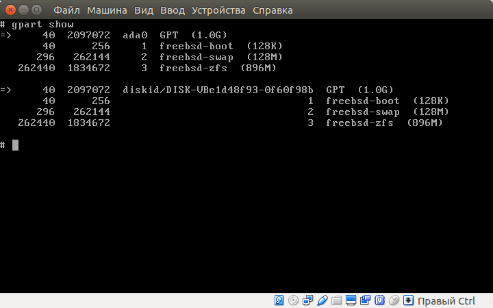

* TOC 
{:toc}

    <a href="#a">A</a> <a href="#b">B</a> <a href="#c">C</a> <a href="#d">D</a> <a href="#e">E</a> <a href="#f">F</a> <a href="#g">G</a> <a href="#h">H</a> <a href="#i">I</a> <a href="#j">J</a> <a href="#k">K</a> <a href="#l">L</a> <a href="#m">M</a> <a href="#n">N</a> <a href="#o">O</a> <a href="#p">P</a> <a href="#q">Q</a> <a href="#r">R</a> <a href="#s">S</a> <a href="#t">T</a> <a href="#u">U</a> <a href="#v">V</a> <a href="#w">W</a> <a href="#x">X</a> <a href="#y">Y</a> <a href="#z">Z</a>

https://confluence.id-network.ru/pages/viewpage.action?pageId=12618684

# A
# B
# C

## chroot - ?

 
    

        Ключи
    

<table>
<ul>
    <li><b></b> - 
    <pre><code class="perl">
    </code></pre>
    </li>

</ul>
</table>

<b>Примеры</b>

    

        Пример
    

    <pre><code class="perl">
        content
    </code></pre>

## curl - ?

 
    

        Ключи
    

<table>
<ul>
    <li><b>-o, --output</b> -  сохранить результат в файл
    <pre><code class="perl">
/sdcard/develop$ curl google.ru -o index.html
  % Total    % Received % Xferd  Average Speed   Time    Time     Time  Current
                                 Dload  Upload   Total   Spent    Left  Speed
  0     0    0     0    0     0      0      0100   218  100   218    0     0   1801      0100   218  100   218    0     0   1758      0 --:--:-- --:--:-- --:--:--  1744
/sdcard/develop$ cat index.html
<HTML><HEAD><meta http-equiv="content-type" content="text/html;charset=utf-8">
<TITLE>301 Moved</TITLE></HEAD><BODY>
<H1>301 Moved</H1>
The document has moved
<A HREF="http://www.google.ru/">here</A>.
</BODY></HTML>
/sdcard/develop$
    </code></pre>
</li>
    <li><b>-O</b> - 
    <pre><code class="perl">'curl --help' for more information
/sdcard/develop$ curl -O https://hsto.org/webt/i4/qq/si/i4qqsiiqayis2mfqyhqyxoko5lg.jpeg
  % Total    % Received % Xferd  Average Speed   Time    Time     Time  Current
                                 Dload  Upload   Total   Spent    Left  Speed
  0     0    0     0    0     0      0      0 43 78179   43 34247    0     0  41815      0100 78179  100 78179    0     0  50930      0  0:00:01  0:00:01 --:--:-- 50930
/sdcard/develop$
    </code></pre>
    </li>

</ul>
</table>

<b>Примеры</b>

    

        Пример
    

    <pre><code class="perl">
        content
    </code></pre>

# D

## df - Показывает сведения о файловой системе 

 
    

        Ключи
    

<table>
<ul>

    <li><b>-h, --human-readable</b> - показывает размеры в человеко читаемом формате
        <pre><code class="bash">root@freebsd11:/test02 # df -h /test02/
Filesystem     Size    Used   Avail Capacity  Mounted on
/dev/ada0p2    9.0G    1.1G    7.2G    13%    /
        </code></pre>
    </li>

    <li><b></b> - 
    <pre><code class="perl">
    </code></pre>
    </li>

    <li><b></b> - 
    <pre><code class="perl">
    </code></pre>
    </li>

</ul>
</table>

    

        Формат
    

    <table><tr><th>Ключ</th><th>Описание</th></tr>
        <tr><td>Filesystem</td><td>Название файловой системы</td></tr>
        <tr><td>Size</td><td>Общий размер</td></tr>
        <tr><td>Used</td><td>Сколько использованно</td></tr>
        <tr><td>Avail</td><td>Сколько свободно</td></tr>
        <tr><td>Capacity</td><td></td></tr>
        <tr><td>Mounted on</td><td>Точка монторования</td></tr>
    </table>

<b>Примеры</b>

    

        Пример
    

    <pre><code class="perl">
        content
    </code></pre>

## du: Disk Usage - информация об использовании дискового пространства

    

        Ключи
    

<ul>
    <li><b>-s, --summarize</b> - показывать итог</li>
    <li><b>-h, --human-readable</b> - печатать размеры в удобном для человека виде (например: 1K, 234M, 2G)</li>
</ul>

<b>Примеры</b>

    

        Сколько весит директория
    

    <pre><code class="perl">avis@PC:~$ du -sh develop/
2,6G    develop/
    </code></pre>

<!-- ------------------------------------------------------------- -->

# E
# F
# G
# H

## htop - вывод списка запущенных процессов

 
    

        Ключи
    

<table>
<ul>
    <li><b></b> - 
    <pre><code class="perl">
    </code></pre>
    </li>

</ul>
</table>

 
    

        Управление
    

<table>
<ul>

    <li><b>F3</b> - Поиск</li>
    <li><b>F4</b> - Фильтр</li>
    <li><b>F5</b> - Показать треды
        
    </li>
    <li><b>F6</b> - Свернуть/Раскрыть треды</li>
    <li><b>F7</b> - Уменьшить приоритет</li>
    <li><b>F8</b> - Увеличить приоритет</li>
    <li><b>F9</b> - Убить процесс</li>

    <li><b>Shift + F</b> - Следить за процессом
        
    </li>

</ul>
</table>

<b>Примеры</b>

    

        Пример
    

    <pre><code class="perl">
        content
    </code></pre>

## host - получения информации DNS-серверов 

 
    

        Ключи
    

<ul>
    <li><b></b> - </li>
</ul>

<b>Примеры</b>

    

        Узнать ip по домену
    

    <pre><code class="perl">$ host ya.ru
ya.ru has address 87.250.250.242
ya.ru has IPv6 address 2a02:6b8::2:242
ya.ru mail is handled by 10 mx.yandex.ru.
    </code></pre>

    

        Узнать домен по ip
    

    <pre><code class="perl">$ host 87.250.250.242
242.250.250.87.in-addr.arpa domain name pointer ya.ru.
    </code></pre>

<!-- ------------------------------------------------------------- -->

# I

## iptables - файервол

    

        Ключи
    

<ul>
    <li><b></b> - </li>
</ul>

<b>Примеры</b>

    

        Пример
    

    <pre><code class="perl">
        content
    </code></pre>

<!-- ------------------------------------------------------------- -->

# J
# K

## kldload - ?

<a href="https://www.freebsd.org/cgi/man.cgi?kldload(8)" target="_blank">kldload</a>

 
    

        Ключи
    

<table>
<ul>
    <li><b></b> - 
    <pre><code class="perl">
    </code></pre>
    </li>

</ul>
</table>

<b>Примеры</b>

    

        Пример
    

    <pre><code class="perl">
        content
    </code></pre>

# L

## ls - список файлов и атрибутов

 
    

        Ключи
    

<table>
<ul>

<li><b></b>1 - Вывести список всех файлов в столбик, без указания дополнительных параметров</li>
<li><b></b>a - Вывести список всех файлов, включая файлы, имена которых начинаются с точки </li>

<li><b></b>l - Подробный вывод, включая атрибуты файлов.</li>
<li><b></b>t - Сортировать по названию</li>
<li><b></b>h - ("human-readable" - удобный для восприятия), чтобы размер файлов выводился в килобайтах, мегабайтах и гигабайтах вместо байтов</li>
<li><b></b>F - Пометить имена определенных файлов целевыми символами, указывающими на топ файлов. Приписывает"/" к иректориям, "*" к исполняемым файлам, "@" к символьным ссылкам, "|" к именованных каналам и "=" - к сокетам. Это просто визуальные индикаторы, которые на самом деле не являются частью</li>
имени файла 
<li><b></b>i - Добавить к выводу информационные дескрипторы (inode) файлов</li>
<li><b></b>s - Добавить размер файла в блоках, полезно для сортировки файлов по размеру:</li>
<li><b></b>R - При выводе содержимого директории вывести рекурсивно дерево подкаталогов с выдачей их содержимого </li>
<li><b></b>d - При выводе содержимого директории вывести имена каталогов так, как если бы они были обычными файлами, а не показывать их содержимое (?)</li>

</ul>
</table>

<b>Примеры</b>

    

        Пример
    

    <pre><code class="perl">
        content
    </code></pre>

## lsof - какие файлы используются процессами

    

        Ключи
    

<ul>
    <li><b>-u</b> - Список файлов открытые пользователем
        <pre><code class="perl">$ lsof -u avis | wc -l
12903
        </code></pre>
    </li>
    <li><b>-U</b> - Файлы открытые процессом. Знак ^ инвертирует поиск

        <pre><code class="perl">:~/tmp$ perl -e 'sleep 10; print 1'
$ lsof -cperl
COMMAND   PID USER   FD   TYPE DEVICE SIZE/OFF    NODE NAME
perl    21941 avis  cwd    DIR    8,5     4096  280406 /home/avis/tmp
perl    21941 avis  rtd    DIR    8,5     4096       2 /
perl    21941 avis  txt    REG    8,5  1907192 2097180 /usr/bin/perl
perl    21941 avis  mem    REG    8,5  4234816 2104059 /usr/lib/locale/locale-archive
...
        </code></pre>
    <pre><code class="perl">$ lsof -c^perl | head </code></pre>

    </li>
    <li><b>+d</b> - Список файлов открытых в директории(но не в поддиректориях)

    <pre><code class="perl">avis@avis-PC[13:39:32]:~/develop/doc/_posts$ lsof +d .
COMMAND     PID USER   FD   TYPE DEVICE SIZE/OFF    NODE NAME
plugin_ho  4296 avis   19r   REG    8,5    21870 1837814 ./2018-07-09-alg-book.md
lsof      13108 avis  cwd    DIR    8,5     4096 1837936 .
lsof      13109 avis  cwd    DIR    8,5     4096 1837936 .
bash      13235 avis  cwd    DIR    8,5     4096 1837936 .

    </code></pre>

    </li>
    <li><b>-d</b> - Эта опция позволяет задать список дескрипторов файлов, разделённых запятой, которые надо включить в вывод или исключить из него.

    <pre><code class="perl">$ yes > /dev/null
$ lsof -d 0,1,2 | grep yes
yes       13822 avis    0u   CHR             136,21      0t0      24 /dev/pts/21
yes       13822 avis    1w   CHR                1,3      0t0       6 /dev/null
yes       13822 avis    2u   CHR             136,21      0t0      24 /dev/pts/21

    </code></pre>
    </li>
    <li><b>-p</b> - Список файлов открытым процессом по пиду

    <pre><code class="perl">$ lsof -p 14167
COMMAND   PID USER   FD   TYPE DEVICE SIZE/OFF    NODE NAME
perl    14167 avis  cwd    DIR    8,5     4096  262146 /home/avis
perl    14167 avis  rtd    DIR    8,5     4096       2 /
perl    14167 avis  txt    REG    8,5  1907192 2097180 /usr/bin/perl
perl    14167 avis  mem    REG    8,5  4234816 2104059 /usr/lib/locale/locale-archive
perl    14167 avis  mem    REG    8,5    39224 3807413 /lib/x86_64-linux-gnu/libcrypt-2.23.so
perl    14167 avis  mem    REG    8,5  1868984 3802622 /lib/x86_64-linux-gnu/libc-2.23.so
perl    14167 avis  mem    REG    8,5   138696 3801184 /lib/x86_64-linux-gnu/libpthread-2.23.so
perl    14167 avis  mem    REG    8,5  1088952 3801179 /lib/x86_64-linux-gnu/libm-2.23.so
perl    14167 avis  mem    REG    8,5    14608 3805631 /lib/x86_64-linux-gnu/libdl-2.23.so
perl    14167 avis  mem    REG    8,5   162632 3801183 /lib/x86_64-linux-gnu/ld-2.23.so
perl    14167 avis    0u   CHR 136,21      0t0      24 /dev/pts/21
perl    14167 avis    1u   CHR 136,21      0t0      24 /dev/pts/21
perl    14167 avis    2u   CHR 136,21      0t0      24 /dev/pts/21

    </code></pre>

    </li>
    <li><b>-i </b> - позволяет вывести сведения о файлах, интернет-адреса которых соответствуют заданному адресу.

    <pre><code class="perl">~$ lsof -i 
COMMAND     PID USER   FD   TYPE  DEVICE SIZE/OFF NODE NAME
plugin_ho  4296 avis   20u  IPv4   33003      0t0  TCP 192.168.1.35:37596->45.55.41.223:http (CLOSE_WAIT)
chrome    17982 avis   83u  IPv4 1429216      0t0  TCP 192.168.1.35:33904->lu-in-f188.1e100.net:5228 (ESTABLISHED)
chrome    17982 avis  105u  IPv4 1413784      0t0  UDP *:mdns 
chrome    17982 avis  124u  IPv4 1507179      0t0  UDP 192.168.1.35:46459->lk-in-f100.1e100.net:https 
chrome    17982 avis  125u  IPv6 1413785      0t0  UDP *:mdns 
chrome    17982 avis  132u  IPv4 1508698      0t0  TCP localhost:50142->localhost:4000 (ESTABLISHED)
chrome    17982 avis  134u  IPv4 1508701      0t0  TCP localhost:50146->localhost:4000 (ESTABLISHED)
chrome    17982 avis  142u  IPv4 1507651      0t0  TCP 192.168.1.35:44116->mc.yandex.ru:https (ESTABLISHED)
chrome    17982 avis  143u  IPv4 1508356      0t0  TCP 192.168.1.35:57894->104.236.216.52:https (ESTABLISHED)
chrome    17982 avis  157u  IPv4 1508718      0t0  TCP localhost:32902->localhost:35729 (ESTABLISHED)
chrome    17982 avis  170u  IPv4 1505882      0t0  TCP 192.168.1.35:40184->collector.mediator.media:https (ESTABLISHED)
chrome    17982 avis  178u  IPv4 1508713      0t0  TCP localhost:32898->localhost:35729 (ESTABLISHED)
ruby2.3   19055 avis    8u  IPv4  817337      0t0  TCP localhost:4000 (LISTEN)
ruby2.3   19055 avis   12u  IPv4  817333      0t0  TCP localhost:4001 (LISTEN)
ruby2.3   19055 avis   13u  IPv4  817336      0t0  TCP localhost:35729 (LISTEN)
ruby2.3   19055 avis   16u  IPv4 1508699      0t0  TCP localhost:4000->localhost:50142 (ESTABLISHED)
ruby2.3   19055 avis   17u  IPv4 1508714      0t0  TCP localhost:35729->localhost:32898 (ESTABLISHED)
ruby2.3   19055 avis   18u  IPv4 1508702      0t0  TCP localhost:4000->localhost:50146 (ESTABLISHED)
ruby2.3   19055 avis   19u  IPv4 1508719      0t0  TCP localhost:35729->localhost:32902 (ESTABLISHED)
    </code></pre>

    </li>
    <li><b>-t</b> - Список PID-ов процессов использующие файл. Удобно использлвать совместно с kill

    <pre><code class="perl">$ lsof -t ./2018-07-09-alg-book.md
4296
    </code></pre>
    </li>

</ul>

<b>Примеры</b>

    

        Сколько соединений открыты Chrome
    

    <pre><code class="perl">$ lsof -i -a -u $USER | grep chrome
chrome    17982 avis   79u  IPv4 1430215      0t0  TCP 192.168.1.35:52056->srv129-129-240-87.vk.com:https (ESTABLISHED)
chrome    17982 avis   83u  IPv4 1429216      0t0  TCP 192.168.1.35:33904->lu-in-f188.1e100.net:5228 (ESTABLISHED)
chrome    17982 avis  105u  IPv4 1413784      0t0  UDP *:mdns 
chrome    17982 avis  124u  IPv4 1507179      0t0  UDP 192.168.1.35:46459->lk-in-f100.1e100.net:https 
chrome    17982 avis  125u  IPv6 1413785      0t0  UDP *:mdns 
chrome    17982 avis  139u  IPv4 1429165      0t0  TCP 192.168.1.35:51988->srv129-129-240-87.vk.com:https (ESTABLISHED)
chrome    17982 avis  143u  IPv4 1508356      0t0  TCP 192.168.1.35:57894->104.236.216.52:https (ESTABLISHED)
chrome    17982 avis  164u  IPv4 1507411      0t0  UDP 192.168.1.35:60888->lk-in-f194.1e100.net:https 
chrome    17982 avis  170u  IPv4 1505882      0t0  TCP 192.168.1.35:40184->collector.mediator.media:https (ESTABLISHED)
chrome    17982 avis  174u  IPv4 1507455      0t0  TCP localhost:32810->localhost:35729 (ESTABLISHED)
chrome    17982 avis  201u  IPv4 1507460      0t0  TCP localhost:32814->localhost:35729 (ESTABLISHED)
chrome    17982 avis  289u  IPv4 1507443      0t0  TCP localhost:50044->localhost:4000 (ESTABLISHED)
chrome    17982 avis  324u  IPv4 1507326      0t0  TCP localhost:50050->localhost:4000 (ESTABLISHED)
chrome    17982 avis  329u  IPv4 1507448      0t0  TCP localhost:50054->localhost:4000 (ESTABLISHED)
chrome    17982 avis  350u  IPv4 1507450      0t0  TCP localhost:50058->localhost:4000 (ESTABLISHED)

    </code></pre>

    

        Все UDP соединения
    

    <pre><code class="perl">$ lsof -iUDP
COMMAND   PID USER   FD   TYPE  DEVICE SIZE/OFF NODE NAME
chrome  17982 avis  105u  IPv4 1413784      0t0  UDP *:mdns 
chrome  17982 avis  125u  IPv6 1413785      0t0  UDP *:mdns 

        content
    </code></pre>

<!-- ------------------------------------------------------------- -->

# M

## mkdir - Создаение директории

 
    

        Ключи
    

<table>
<ul>
    <li><b>-p</b> - создание "родителей"
    <pre><code class="perl">
    </code></pre>
    </li>

</ul>
</table>

<b>Примеры</b>

    

        Пример
    

    <pre><code class="perl">
        content
    </code></pre>

# N

## nmcli - утилита для управления сетевыми соединениями

 
    

        Ключи
    

<ul>
    <li><b>device</b> - Список устройств

    <pre><code class="perl">$ nmcli device
УСТРОЙСТВО  ТИП       СОСТОЯНИЕ      СОЕДИНЕНИЕ    
wlp2s0      wifi      подключено     Keenetic-0617 
enp3s0      ethernet  недоступен     --            
lo          loopback  не настроенно  --   
    </code></pre>

    </li>

    <li><b>connection [up|down] interface</b> - Включить/выключить интерфейс

        <pre><code class="perl">$ nmcli connection down Keenetic-0617
Соединение 'Keenetic-0617' успешно выключено (Активный путь DBus: /org/freedesktop/NetworkManager/ActiveConnection/2)
        </code></pre>

        <pre><code class="perl">$ nmcli connection up Keenetic-0617
Соединение успешно активировано (адрес действующего D-Bus: /org/freedesktop/NetworkManager/ActiveConnection/3)
        </code></pre>
    </li>

</ul>

<b>Примеры</b>

    

        Пример
    

    <pre><code class="perl">
        content
    </code></pre>

<!-- ------------------------------------------------------------- -->

# O
# P
# Q
# R
# S

## ss: socket statistics - мониторинг сетевых подключений

TODO: - https://losst.ru/monitoring-setevyh-podklyuchenij-v-linux

 
    

        Ключи
    

<ul>
    <li><b>-s, --summary</b> - Итого

            <pre><code class="perl">$ ss -s
Total: 1183 (kernel 0)
TCP:   37 (estab 19, closed 4, orphaned 0, synrecv 0, timewait 1/0), ports 0

Transport Total     IP        IPv6
*     0         -         -        
RAW   1         0         1        
UDP   17        14        3        
TCP   33        30        3        
INET      51        44        7        
FRAG      0         0         0  
            </code></pre>

    </li>

    <li><b>-l</b> - Слушающие</li>
    <li><b>-a</b> - Ожидающие</li>
    <li><b>-t</b> - TCP</li>
    <li><b>-x</b></li> - <a href="https://ru.wikipedia.org/wiki/%D0%A1%D0%BE%D0%BA%D0%B5%D1%82_%D0%B4%D0%BE%D0%BC%D0%B5%D0%BD%D0%B0_UNIX" target="blank">Unix</a>
    
<b>Фильтры</b>

<li><b>all</b> - все состояния</li>
<li><b>established</b> - </li>
<li><b>syn-sent</b> - </li>
<li><b>syn-recv</b> - </li>
<li><b>fin-wait-1</b> - </li>
<li><b>fin-wait-2</b> - </li>
<li><b>time-wait</b> - </li>
<li><b>closed</b> - </li>
<li><b>close-wait</b> - </li>
<li><b>last-ack</b> - </li>
<li><b>listening</b> - </li>
<li><b>closing</b> - </li>
<li><b>connected</b> - все состояния, кроме ожидающих соединения и закрытых</li>
<li><b>synchronized</b> - все состояния, соответствующие установленным соединениям, за исключением syn-sent</li>
<li><b>bucket</b> - состояния, представляющие собой минисокеты, например — time-wait и syn-recv</li>
<li><b>big</b> - всё кроме того, что соответствует идентификатору bucket</li>
    
</ul>

<b>Примеры</b>

    

        Все ожидающие TCP соединения с IPv4
    

    <pre><code class="perl">
avis@PC:~$ ss -t4 state listening
Recv-Q Send-Q                                      Local Address:Port                                                       Peer Address:Port                
0      50                                                      *:microsoft-ds                                                          *:*                    
0      80                                              127.0.0.1:mysql                                                                 *:*                    
0      50                                                      *:netbios-ssn                                                           *:*                    
0      128                                             127.0.0.1:11211                                                                 *:*                    
0      10                                              127.0.0.1:2222                                                                  *:*                    
0      5                                               127.0.1.1:domain                                                                *:*                    
0      100                                                     *:smtp                                                                  *:*                    

    </code></pre>

    

        Информация о подключенном IP
    

            <pre><code class="bash">
root@host0:~# ss dst 192.168.33.1
Netid  State      Recv-Q Send-Q                                           Local Address:Port                                               Peer Address:Port   
tcp    ESTAB      0      0                                                192.168.33.10:ssh                                                192.168.33.1:58484   
</code></pre>

Узнать, кто занял порт, можно одной из следующих команд:

            <pre><code class="bash">
ss -p state listening '( sport = :443 )'
ss -tlp '( sport = :443 )'
ss -p state listening '( sport = :http or sport = :https )'
            </code></pre>

Процесс:

            <pre><code class="bash">
ss -4tlp | grep nginx
            </code></pre>

    

        Можно ещё добавить, если на дисплее не помещается:
    

            <pre><code class="bash">
ss -tlp '( sport = :443 )' | tr -d '\t'
            </code></pre>

<!-- ------------------------------------------------------------- -->

# T
# U
# V
# W
# X
# Y
# Z

## zpool - ?

 
    

        Ключи
    

<table>
<ul>
    <li><b>-f, --force</b> - 
    <pre><code class="perl">
    </code></pre>
    </li>

    <li><b>-d</b> - Отключить все фичи по умолчанию
    <pre><code class="perl">
    </code></pre>
    </li>

    <li><b>-o property=value</b> - включить <a href="#features">фичу</a>
    <pre><code class="perl">
    </code></pre>
    </li>

    <li><b>-O file-system-property=value</b> - <a href="#settings_fs">Настройки файловой системы</a>
    <pre><code class="perl">
    </code></pre>
    </li>

</ul>
</table>

<b>Примеры</b>

    

        Пример
    

    <pre><code class="perl">
        content
    </code></pre>

# OLD

## template - описание на русском

 
    

        Ключи
    

<table>
<ul>
    <li><b></b> - 
    <pre><code class="perl">
    </code></pre>
    </li>

</ul>
</table>

<b>Примеры</b>

    

        Пример
    

    <pre><code class="perl">
        content
    </code></pre>

<!-- ------------------------------------------------------------- -->
                    <td>-m</td>
                    <td>
точка монторования
Если ее нет, то нужно выбрать legacy или none

                        <ol>
                            <li>none - без монтирования</li>
                            <li>legacy - как я понимаю это наследование уровневых путей. например /export/stuff, то pool/home/user путем наследования получает значение /export/stuff/user
                                
Старые точки монтирования. Управление файловыми системами ZFS можно осуществлять при помощи старых средств. Для этого свойство mountpoint должно иметь значение legacy. Управление старыми файловыми системами должно осуществляться с помощью команд mount и umount и файла /etc/vfstab. ZFS не выполняет автоматическое монтирование старых файловых систем при начальной загрузке, и для наборов данных этого типа команды ZFS mount и umount не используются. В следующих примерах демонстрируется настройка и администрирование набора данных ZFS в режиме "legacy":
</li>
                        </ol>
                    </td>
                </tr>
            </table>

            <ol>
                <li>create - создает пул из 1 или нескольких жеских дисков (страйп режим)</li>
                <pre><code class="bash">
# создаем пул с разделенным методом т.е. часть на 1 диск часть на другой
root@freebsd11:~ # zpool create test01 /dev/ada1 /dev/ada2 
root@freebsd11:~ # zpool list
NAME     SIZE  ALLOC   FREE  EXPANDSZ   FRAG    CAP  DEDUP  HEALTH  ALTROOT
test01  1.97G    93K  1.97G         -     0%     0%  1.00x  ONLINE  -

# создание зеркального пула. Все данные зеркалируются на оба диска
root@freebsd11:/ # zpool create test02 mirror /dev/ada1 /dev/ada2 
root@freebsd11:/ # zpool status
  pool: test02
 state: ONLINE
  scan: none requested
config:

    NAME        STATE     READ WRITE CKSUM
    test02      ONLINE       0     0     0
      mirror-0  ONLINE       0     0     0
        ada1    ONLINE       0     0     0
        ada2    ONLINE       0     0     0

errors: No known data errors
                </code></pre>

                <li>add - добавляет новый диск в пул в страйп режим</li>
                <pre><code class="bash">
root@freebsd11:~ # zpool list
NAME     SIZE  ALLOC   FREE  EXPANDSZ   FRAG    CAP  DEDUP  HEALTH  ALTROOT
test01  1008M   522K  1007M         -     0%     0%  1.00x  ONLINE  -
root@freebsd11:~ # zpool add test01 /dev/ada2
root@freebsd11:~ # zpool list
NAME     SIZE  ALLOC   FREE  EXPANDSZ   FRAG    CAP  DEDUP  HEALTH  ALTROOT
test01  1.97G   104K  1.97G         -     0%     0%  1.00x  ONLINE  -
                </code></pre>

                <li>detach - отсоединяет диск от пула. Работает в mirror режиме</li>
                <pre><code class="bash">
root@freebsd11:/ # zpool detach test02 /dev/ada1 
root@freebsd11:/ # zpool status
  pool: test02
 state: ONLINE
  scan: none requested
config:

    NAME        STATE     READ WRITE CKSUM
    test02      ONLINE       0     0     0
      ada2      ONLINE       0     0     0

errors: No known data errors
                </code></pre>

                <li>attach - присоединяет диск от пула. Работает в mirror режиме</li>
                <pre><code class="bash">
root@freebsd11:/ # zpool attach test02 /dev/ada2 /dev/ada1 
root@freebsd11:/ # zpool status
  pool: test02
 state: ONLINE
  scan: resilvered 78.5K in 0h0m with 0 errors on Wed Jan  3 02:21:44 2018
config:

    NAME        STATE     READ WRITE CKSUM
    test02      ONLINE       0     0     0
      mirror-0  ONLINE       0     0     0
        ada2    ONLINE       0     0     0
        ada1    ONLINE       0     0     0

errors: No known data errors
</code></pre>
                <li>replace - заменяет диски</li>
                <pre><code class="bash">
root@freebsd11:/test01 # zpool replace test01 /dev/ada1 /dev/ada3 
root@freebsd11:/test01 # zpool status
  pool: test01
 state: ONLINE
  scan: resilvered 58.5K in 0h0m with 0 errors on Wed Jan  3 02:11:23 2018
config:

    NAME        STATE     READ WRITE CKSUM
    test01      ONLINE       0     0     0
      ada3      ONLINE       0     0     0
      ada2      ONLINE       0     0     0

errors: No known data errors
                </code></pre>

                <li>status - выводит подробный статус пула</li>
                <pre><code class="bash">
root@freebsd11:~ # zpool status
  pool: test01
 state: ONLINE
  scan: none requested
config:

    NAME        STATE     READ WRITE CKSUM
    test01      ONLINE       0     0     0
      ada1      ONLINE       0     0     0
                </code></pre>

                <li>list - выводит список пулов</li>
                <pre><code class="bash">
root@freebsd11:~ # zpool list
NAME     SIZE  ALLOC   FREE  EXPANDSZ   FRAG    CAP  DEDUP  HEALTH  ALTROOT
test01  1008M    86K  1008M         -     0%     0%  1.00x  ONLINE  -
test02  1008M   500K  1008M         -     0%     0%  1.00x  ONLINE  -
                </code></pre>

                <li>destroy - удалить пул. При удалении пула, удаляется и фс !</li>
                <pre><code class="bash">
root@freebsd11:~ # zpool destroy test01
root@freebsd11:~ # zpool list
NAME     SIZE  ALLOC   FREE  EXPANDSZ   FRAG    CAP  DEDUP  HEALTH  ALTROOT
test02  1008M   500K  1008M         -     0%     0%  1.00x  ONLINE  -
                </code></pre>
            </ol>

            <li>set - установка параметров пулу</li>
                <pre><code class="bash">
todo
                </code></pre>

                <li>destroy - удалить пул. При удалении пула, удаляется и фс !</li>
                <pre><code class="bash">
root@freebsd11:~ # zpool destroy test01
root@freebsd11:~ # zpool list
NAME     SIZE  ALLOC   FREE  EXPANDSZ   FRAG    CAP  DEDUP  HEALTH  ALTROOT
test02  1008M   500K  1008M         -     0%     0%  1.00x  ONLINE  -
                </code></pre>
            </ol>

            <h3 id="features">Фичи</h3>
            <table>
                <tr>
                    <th>Опция</th>
                    <th>Описание</th>
                </tr>
                <tr>
                    <td>feature@lz4_compress=enabled</td>
                    <td>Компрессия сжатия данных</td>
                </tr>
                <tr>
                    <td>ashift=12</td>
                    <td>?</td>
                </tr>
            </table>

            <h3 id="settings_fs">Настройки фс</h3>
            <table>
                <tr>
                    <th>Опция</th>
                    <th>Описание</th>
                </tr>
                <tr>
                    <td>compression=lz4</td>
                    <td>Установка способа сжатия</td>
                </tr>
            </table>

            

    <!-- ------------------------------------------------------------- -->

            <h2 id="zfs">zfs</h2>
            
zfs [действие] [диск] [ключи]

            
Утилита использование zfs системы

            <h3>ключи:</h3>
            <table><tr><th>Ключ</th><th>Описание</th></tr>
                <tr>
                    <td>-p</td>
                    <td>создать "родителей"</td>
                </tr>
                <tr>
                    <td>-r</td>
                    <td>удалить рекурсивно</td>
                </tr>
            </table>

            <ol>
                <li>list - список файловых систем</li>
                <pre><code class="bash">
root@freebsd11:~ # zfs list
NAME     USED  AVAIL  REFER  MOUNTPOINT
test01    74K   880M    23K  /test01
test02   293K   880M    23K  /test02
                </code></pre>

                <li>create - создание новой файловой системы</li>
                <pre><code class="bash">
# Создание вложенных фс
root@freebsd11:~ # zfs create -p test01/data/www
root@freebsd11:~ # ls -l /test01/data/www/
total 0

# создание без точек монтирования
root@freebsd11:~ # zfs create -o mountpoint=none test01/home 
root@freebsd11:~ # zfs list
NAME              USED  AVAIL  REFER  MOUNTPOINT
test01            168K   880M    23K  /test01
test01/data        46K   880M    23K  /test01/data
test01/data/www    23K   880M    23K  /test01/data/www
test01/home        23K   880M    23K  none
test02            293K   880M    23K  /test02
                </code></pre>

                <li>destroy - удаление фс</li>
                <pre><code class="bash">
root@freebsd11:~ # zfs destroy test01/home
root@freebsd11:~ # zfs list
NAME              USED  AVAIL  REFER  MOUNTPOINT
test01            132K   880M    23K  /test01
test01/data        46K   880M    23K  /test01/data
test01/data/www    23K   880M    23K  /test01/data/www
test02            293K   880M    23K  /test02

# Удаление рекурсивно, в случае если фс содержит вложенные фс
root@freebsd11:~ # zfs destroy -r test01/data
root@freebsd11:~ # zfs list
NAME     USED  AVAIL  REFER  MOUNTPOINT
test01  87.5K   880M    23K  /test01
test02   293K   880M    23K  /test02
                </code></pre>

            </ol>

            

    <!-- ------------------------------------------------------------- -->

            

    <!-- ------------------------------------------------------------- -->

    <!-- ------------------------------------------------------------- -->

            <h2 id="gpart">gpart</h2>
            
gpart [действие] [ключи] [диск]

            
Программа для разметки дисков

            
gpart - “guess PC-type hard disk partitions” - “угадай тип раздела жесткого диска”

            <pre><code class="bash">
todo
            </code></pre>

            

    <!-- ------------------------------------------------------------- -->

            <h2 id="mkfile">mkfile</h2>
            
mkfile [опции] [размер][ед. измерения] [путь до файла]

            
Создание файла указанного размера

            <h3>опции:</h3>
            TODO

            <h3>ед. измерения:</h3>
            <ul>
                <li>e</li>
                <li>p</li>
                <li>t</li>
                <li>g</li>
                <li>m - мегабайты</li>
                <li>k</li>
                <li>b</li>
            </ul>

            <h3>Пример:</h3>
            
Создать файл /test/foo, размером 100 мб.

            <pre><code class="bash">
=======
            <h3>Ключи:</h3>
            <table><tr><th>Ключ</th><th>Описание</th></tr>
                <tr>
                    <td>-t</td>
                    <td>тип:
                        <ul>
                            <li>gpt</li>
                            <li>freebsd-boot</li>
                            <li>freebsd-swap</li>
                            <li>freebsd-zfs</li>
                        </ul>
                    </td>
                </tr>
                <tr><td>-l</td><td>установить лейбл</td></tr>
                <tr><td>-s</td><td>размер в килобайтах</td></tr>
                <tr><td>-i</td><td>порядковый номер</td></tr>
                <tr><td>-F</td><td> </td></tr>
                <tr><td>-b</td><td>параметр смещения</td></tr>
                <tr><td>-p</td><td> </td></tr>
                <tr><td>-i</td><td>индекс удаляемого раздела</td></tr>
            </table>

            <h3>Действия</h3>

            <ol>
                <li>create - создает таблицу разделов</li>
                <pre><code class="bash">
gpart create -s gpt ada0
                </code></pre>

                <li>add - добавляет новый раздел</li>
                <pre><code class="bash">
# Создаем загрузочный раздел
gpart add -b 40 -t freebsd-boot -l gpboot -s 64k ada0

# если разметка ufs то создаем:
# свап
gpart add -t freebsd-swap -l gpswap -s 128M ada0

# подсистемы
# основной раздел
gpart add -t freebsd-ufs -l gproot -s 256M ada0 

# для логи
gpart add -t freebsd-ufs -l gpvar -s 256M ada0

# для временных файлов
gpart add -t freebsd-ufs -l gptmp -s 256M ada0

# для общих файлов
gpart add -t freebsd-ufs -l gpusr ada0

# если zfs, то достаточно
gpart add -t freebsd-zfs -l disk ada0

                </code></pre>

                <li>show - показать таблицу разделов</li>
                

                <li>bootcode - загрузочный код ?</li>
                <pre><code class="bash">
gpart bootcode -b /boot/pmbr -p /boot/gptboot -i 1 ada0
                </code></pre>
                <ol>
                    <li>-p partcode</li>
                    <li>-p bootcode</li>
                </ol>
                <li>delete - удаляет раздел</li>
                <li>destroy - очищает файловую систему</li>
            </ol>

                

    <!-- ------------------------------------------------------------- -->

                <h2 id="mount">mount</h2>
                
mount [ключи] [от куда] [куда]

                
Монтирование файловых систем

                
                <h3>Ключи:</h3>
                <table><tr><th>Ключ</th><th>Описание</th></tr>
                    <tr>
                        <td>-t, --types</td>
                        <td>тип файловой системы:
                            <ul>
                                <li>nullfs - можно использовать как симлинки на диры. Работает только в FreeBSD</li>
                                <li>zfs</li>
                            </ul>
                        </td>
                    </tr>
                </table>

                <h3>Пример:</h3>
                
TODO

                <pre><code class="bash">

                </code></pre>

                

    <!-- ------------------------------------------------------------- -->

                <h2 id="mkfile">mkfile</h2>
                
mkfile [ключи] [размер][ед. измерения] [путь до файла]

                
Создание файла указанного размера

                <h3>ключи:</h3>
                TODO

                <h3>ед. измерения:</h3>
                <ul>
                    <li>e</li>
                    <li>p</li>
                    <li>t</li>
                    <li>g</li>
                    <li>m - мегабайты</li>
                    <li>k</li>
                    <li>b</li>
                </ul>

                <h3>Пример:</h3>
                
Создать файл /test/foo, размером 100 мб.

                <pre><code class="bash">
>>>>>>> 22791dbebf8ccaf15306325f6984275abc558e95
mkfile 100m /test/foo
            </code></pre>

            <h3>Установка</h3>

            <h4>FreeBSD</h4>

            <pre><code class="bash">
root@freebsd11:~ # pkg search mkfile
mkfile-1.1.3_1                 Create files suitable for use as swap files
root@freebsd11:~ # pkg install mkfile-1.1.3_1
            </code></pre>

            

            
            <h2 id="dd">dd</h2>
            
dd if=[откуда] of=[куда] [опции]

            
Копирование данных побайтово

            <h3>опции:</h3>
            TODO

            <h3>Пример:</h3>
            
Скопировать из /dev/urandom в /dev/null 5 раз по 100Мб

            <pre><code class="bash">
dd if=/dev/urandom of=/dev/null bs=100M count=5
            </code></pre>
            
            <h2 id="shutdown">shutdown</h2>
            
shutdown [опции] [время] [сообщение]

            
Выключение в заданное время

            <h3>опции:</h3>
            <table>
                <tr>
                    <th>Опция</th>
                    <th>Описание</th>
                </tr>
                    <tr>
                        <td>--help</td>
                        <td>вывести справку по программе</td>
                    </tr>
                    <tr>
                        <td>-H, -halt</td>
                        <td>отключить питание, не завершая процессы и не перемонтируя файловые системы</td>
                    </tr>
                    <tr>
                        <td>-P, -poweroff</td>
                        <td>нормальное выключение</td>
                    </tr>
                    <tr>
                        <td>-r, -reboot</td>
                        <td>перезагрузка</td>
                    </tr>
                    <tr>
                        <td>-k</td>
                        <td>не выполнять реальных действий, а только вывести сообщение</td>
                    </tr>
                    <tr>
                        <td>-no-wall</td>
                        <td>выключить компьютер, но не выводить сообщение</td>
                    </tr>
                    <tr>
                        <td>-c</td>
                        <td>отменить запланированное выключение linux из командной строки</td>
                    </tr>
            </table>

            <table>
                <tr>
                    <th>Время</th>
                    <th>Описание</th>
                </tr>
                <tr>
                    <td>now</td>
                    <td>сейчас</td>
                </tr>
                <tr>
                    <td>+5</td>
                    <td>через 5 минут</td>
                </tr>
                <tr>
                    <td>21:00</td>
                    <td>в 21:00</td>
                </tr>
            </table>

            <h3>Пример:</h3>
            
Перезагрузить систему сейчас

            <pre><code class="bash">
shutdown -r now
            </code></pre>

            

                

    <!-- ------------------------------------------------------------- -->

                <h2 id="dd">dd</h2>
                
dd [ключи] 

                
Копирование данных побайтово

                <h3>Ключи:</h3>
                <table>
                    <tr>
                        <th>Ключ</th>
                        <th>Описание</th>
                    </tr>
                    <tr>
                        <td>--help</td>
                        <td>показать справку и выйти</td>
                    </tr>
                    <tr>
                        <td>--version</td>
                        <td>показать информацию о версии и выйти</td>
                    </tr>
                </table>

                <h3>Пример:</h3>
                
Скопировать из /dev/urandom в of=/dev/null 500мб

                <pre><code class="bash">
dd if=/dev/urandom of=/dev/null bs=100M count=5
                </code></pre>

<h3>man</h3>

Использование: dd [ОПЕРАНД]…
       или:    dd ПАРАМЕТР
Копирует файл, преобразует и форматирует в зависимости от операндов.

  bs=ЧИСЛО        читать и писать до ЧИСЛА байт за раз
  cbs=ЧИСЛО       преобразовывать заданное ЧИСЛО байт за раз
  conv=СПИСОК     преобразовывать файл в соответствии со СПИСКОМ символов,
                  элементы перечисляются через запятую
  count=ЧИСЛО     копировать только заданное ЧИСЛО входных блоков
  ibs=ЧИСЛО       считывать до ЧИСЛА байт за раз (по умолчанию 512)
  if=ФАЙЛ         читать ФАЙЛ, а не стандартный ввод
  iflag=ФЛАГИ     читать в соответствии со списком символов,
                  элементы перечисляются через запятую
  obs=ЧИСЛО       записывать заданное ЧИСЛО байт за раз (по умолчанию 512)
  of=ФАЙЛ         записывать в ФАЙЛ, а не на стандартный вывод
  oflag=ФЛАГИ     записывать в соответствии со списком символов,
                  элементы перечисляются через запятую
  seek=ЧИСЛО      пропустить перед началом вывода заданное ЧИСЛО блоков
                  размером obs
  skip=ЧИСЛО      пропустить перед началом ввода заданное ЧИСЛО блоков
                  размером ibs
  status=ИНФО     заданную ИНФОрмацию не выводить в stderr;
                  «noxfer» — не выводить статистику передачи
                  «none»  — не выводить ничего
                  «progress» — показывать индикатор передачи

После ЧИСЛА блоков и байт может стоять один из умножающий суффиксов:
c =1, w =2, b =512, kB =1000, K =1024, MB =1000*1000, M =1024*1024, xM =M
GB =1000*1000*1000, G =1024*1024*1024 и так далее для T, P, E, Z, Y.

Каждый символ СПИСКА может быть:

  ascii     из EBCDIC в ASCII
  ebcdic    из ASCII в EBCDIC
  ibm       из ASCII в альтернативную EBCDIC
  block     дополнять записи, заканчивающиеся переводом строки, пробелами до
            размера cbs
  unblock   заменять завершающие пробелы в записях размера cbs на
            перевод строки
  lcase     изменять регистр с верхнего на нижний
  ucase     изменять регистр с нижнего на верхний
  sparse    попытаться переместиться, а не записывать в вывод NUL
            входных блоков
  swab      переставить местами каждую пару входных байт
  sync      дополнять каждый входной блок NUL-ми до размера ibs; при
            использовании с block или unblock, дополнять пробелам, а не NUL
  excl      завершать с ошибкой, если выходной файл уже существует
  nocreat   не создавать выходной файл
  notrunc   не обрезать выходной файл
  noerror   продолжать после ошибок чтения
  fdatasync физически записать выходной файл перед завершением
  fsync     аналогично, но записать также метаданные

Символ ФЛАГ может быть таким:

  append    режим добавления (имеет смысл для вывода; рекомендуется conv=notrunc)
  direct    использовать прямой ввод/вывод для данных
  directory выдавать ошибку, если это не каталог
  dsync     использовать синхронизированный ввод/вывод для данных
  sync      то же, но так же и для метаданных
  fullblock накапливать полные блоки входных данных (только iflag)
  nonblock  использовать неблокирующий ввод/вывод
  noatime   не обновлять время последнего доступа
  nocache   запрос на сброс кэша. Смотрите также oflag=sync
  noctty    не назначать управляющий терминал из файла
  nofollow  не следовать по символьным ссылкам
  count_bytes  считать «count=N» как счётчик байт (только с iflag)
  skip_bytes   считать «skip=N» как счётчик байт (только с iflag)
  seek_bytes   считать «seek=N» как счётчик байт (только с oflag)

Если послать работающему процессу «dd» сигнал USR1, он напечатает на
стандартный поток ошибок статистику ввода/вывода и продолжит
копирование.

Ключи:

      --help     показать эту справку и выйти
      --version  показать информацию о версии и выйти

Оперативная справка GNU coreutils: <http://www.gnu.org/software/coreutils/>
Об ошибках в переводе сообщений «dd» сообщайте по адресу <gnu@mx.ru>
Полная документация: <http://www.gnu.org/software/coreutils/dd>
или доступная локально: info '(coreutils) dd invocation'

        </section>
    

<h3>TODO</h3>

## dd if=[откуда] of=[куда] [ключи]

Копирование данных побайтово

~~~

# Скопировать из /dev/urandom в /dev/null 5 раз по 100Мб
dd if=/dev/urandom of=/dev/null bs=100M count=5

~~~
--------------------------------------------------------------------------------------

# mkfile [ключи] [размер][ед. измерения] [путь до файла]

Создание файла указанного размера

ключи
~~~

~~~

ед. измерения:

~~~
  e
  p
  t
  g
  m - мегабайты
  k
  b
~~~

Пример:
~~~

# Создать файл /test/foo, размером 100 мб.
mkfile 100m /test/foo

~~~

Установка:
- FreeBSD

~~~

~~~

